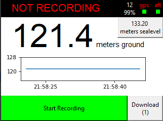
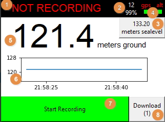
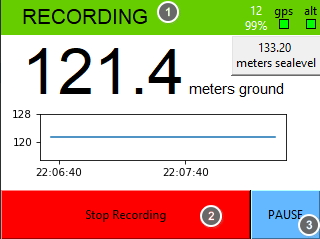
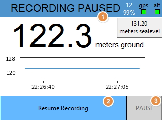
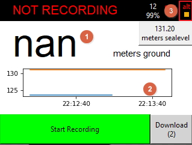
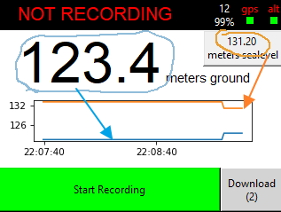
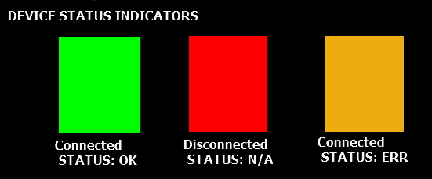
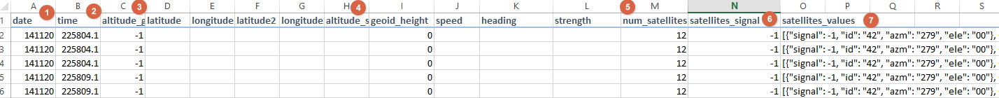

# Installation
 (comming soon)

#Useage

This software connects with an altimeter and usb serial gps puck
to relay the information back to the user, as well as log and provide download utility

### The Interface

 

1. Status Bar - relays current status information
2. GPS Integrity - number of satelites and current signal strength
3. GPS Altitude Display - click to toggle altitude trace on chart
4. Device Status Indicators (see DEVICE STATUS INDICATORS below)
5. Altimeter Display - display meters from ground as reported by altimeter
6. Chart Display - display altitude from one or both inputs
7. Recording Toggle - Start/Stop/Resume recording
8. Download Button - enabled ONLY when a usb drive is connected
   - indicates number of logfiles available in (1)
   - when recording, this button will become a pause button
#### Alternative Screens

##### When Recording (click "Start Recording" Button)

1. both color and text indicate recording status
2. main button will stop current recording
3. download button becomes a PAUSE button allowing to pause and resume within the same csv

##### When Recording is paused (Click "PAUSE" Button, while recording)

1. both color and text indicate paused status
2. main button will resume current csv log
3. PAUSE button is disabled, while state is paused.

##### When there is an issue with the current reading

1. main label displays "nan"
2. causes a break in the current chart trace
3. status light indicates an error reading device

##### When showing 2 traces (sealevel altitude toggled on)

### DEVICE STATUS INDICATORS

Both GPS and the Altimeter will report their
current status by signaling one of 3 colors

### Downloads

When downloading logfiles, you will also find an additional output of raw readings from the gps
as well as potentially an error log from the altimeter

1. the date(from gps) - DDYYMM format
2. the time(from gps UTC Timezone) - HHMMSS includes fractional seconds,
3. the altitude from the altimeter (lidar)
4. the altitude from the gps 
5. the number of satellites in view of gps
6. the average Signal to noise ratio of the top 4 satellites
7. the output of the GPGSV payload
    - result dict contains the following keys as read from $GPGSV payload 
        - id - the id of the satellite (PRN of GSV payload)
        - ele - elevation in degrees 0..90 of satellite
        - azm - azimuth in degrees 0..180 of the satellite
        - signal - signal to noise ratio, -1 is ERR
